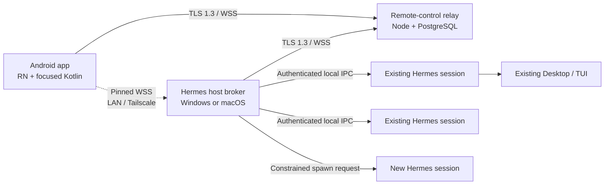

# Executive Brief

## Mission and boundary

Hermes Android Remote Control is a synchronized remote interface to Hermes sessions that remain on a paired Windows or macOS computer. It is not remote desktop, a cloud execution product, or an independent Android shell. The Android app cannot create authority: it can only request operations exposed by the paired host and already permitted by Hermes.

The MVP supports multiple paired computers; explicit remote activation of existing sessions; an opt-in “auto-enable all sessions” policy; basic new-session requests while a host is online; live response/tool/approval/clarification synchronization; interruption and steering; Hermes-mediated attachments, files, terminal views, models, tools, and projects; temporary relay queueing; computer-level zero retention; and authenticated LAN/Tailscale fallback. It does not include Play Store distribution, FCM, recovery codes, provider-secret management, permanent MCP configuration, waking offline computers, or cloud-hosted Hermes execution.

## Evidence-backed current state

Hermes Desktop currently launches `hermes serve` and speaks JSON-RPC over WebSocket to `tui_gateway`. The reusable TypeScript client is [`apps/shared/src/json-rpc-gateway.ts`](https://github.com/NousResearch/hermes-agent/blob/21a2185f86f64be10d28bec1ecc576d89230f761/apps/shared/src/json-rpc-gateway.ts). Session state is persisted by [`hermes_state.py`](https://github.com/NousResearch/hermes-agent/blob/21a2185f86f64be10d28bec1ecc576d89230f761/hermes_state.py), while live RPC/event behavior is concentrated in [`tui_gateway/server.py`](https://github.com/NousResearch/hermes-agent/blob/21a2185f86f64be10d28bec1ecc576d89230f761/tui_gateway/server.py).

That interface is broad but internal. A live session’s `transport` is replaced by `session.resume`/`session.activate`, and session-scoped events are written to that one transport. Consequently, concurrent local and mobile surfaces are not safely synchronized today: the last attaching client becomes the live event owner. WebSocket disconnect handling provides a short grace period, not a durable ordered replay log. The experimental `gateway/relay` subsystem is an outbound messaging connector with useful authentication/retry patterns, but its contract is not a multi-client session protocol and its relay is a trusted cryptographic boundary. It must not be relabeled or extended until the dedicated adapter boundary exists.

## Recommended shape

The narrow waist is a new `remote-control/v1` protocol with JSON Schemas, deterministic state machines, monotonic per-session event sequences, capability hashes, idempotency keys, and explicit snapshot/replay semantics. A host adapter subscribes to gateway events without replacing the local transport. The broker owns pairing, relay presence, replay journals, policy, and routing but never bypasses a session’s Hermes RPC handlers or approval system.

The Android app uses React Native 0.86’s supported New Architecture, TypeScript for UI/state/protocol, and small Kotlin TurboModules for Keystore signing, BiometricPrompt step-up, secure network/certificate pinning, QR/deep-link intake, screen-capture policy, and lifecycle lock. Computer-first navigation prevents accidental cross-host actions.

## Security decision

MVP is content-trusted relay architecture. TLS 1.3 protects links. Relay queue/blob content is encrypted at rest with per-computer AES-256-GCM data-encryption keys wrapped by an operator key. Because relay application workers can decrypt content to route and validate it, the product MUST say “encrypted in transit and at rest,” never “end-to-end encrypted.”

Device and host identities are non-exportable P-256 keys where the platform permits. Security-sensitive envelopes are JWS ES256 signed and bind the computer, device, session, tool call, capability hash, event sequence, nonce/JTI, issue time, and expiry. Thus a compromised relay can observe content in MVP but cannot silently manufacture a valid approval or sensitive host command. One-time QR offers expire after two minutes and require bidirectional proof of possession. Revocation closes active channels and prevents new credentials.

## Delivery recommendation

Proceed to implementation only after Gate 1 accepts:

- trusted-relay MVP wording and retention defaults;
- the new stable adapter instead of exposing raw `tui_gateway`;
- explicit activation as default, auto-enable as opt-in;
- selective offline queue policy;
- Android minimum API 24 and Google Code Scanner plus manual fallback;
- single-replica relay MVP with a tested migration path to distributed fan-out;
- GitHub Releases signed APK distribution, not Play Store.

The test-first plan contains 28 independently reviewable tasks across nine milestones. Every task starts with a failing test, lists exact files/commands/results, and ends in an atomic commit. Production implementation must stop if the multi-client adapter, approval binding, replay invariants, or secure storage cannot be proven.
