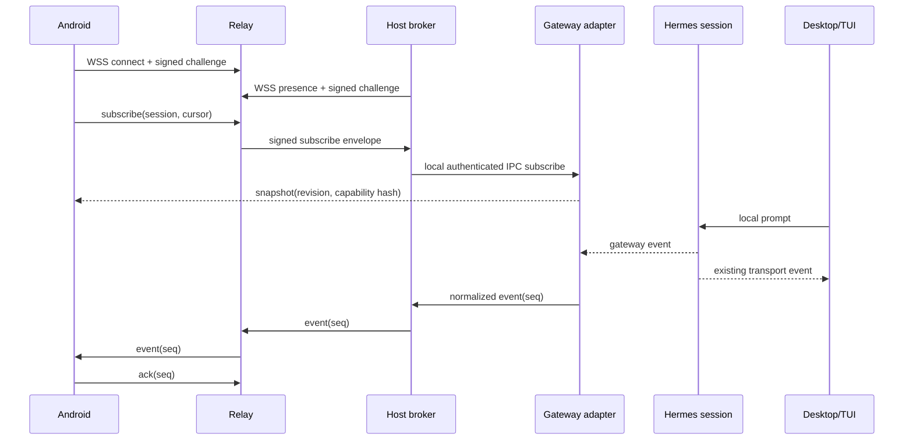
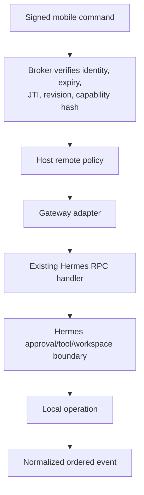

# System Architecture

## Components

1. **`apps/remote-control-protocol`** — TypeScript package containing versioned envelope types, generated validators from canonical JSON Schemas, state reducers, hashing/canonicalization, risk taxonomy, and compatibility tests. It has no React, Node runtime/transport, or Hermes implementation dependency. Hashing and ES256 verification use a narrow asynchronous runtime adapter: Node/relay supplies `jose` plus platform hashing, Android supplies the focused Kotlin native module.
2. **`remote_control`** — Python host package containing the broker, gateway adapter, listener hub bridge, local IPC, pairing, secure store, policy, relay/direct transports, replay journal, attachment mediation, and redacted audit.
3. **`apps/remote-control-relay`** — Node TypeScript modular monolith using built-in HTTP, `ws`, `pg`, `jose`, and `ajv`. It authenticates paired public keys, routes live channels, persists bounded encrypted queues, enforces quota/expiry, and exposes health/metrics.
4. **`apps/android`** — bare React Native 0.86 app using TypeScript and focused Kotlin TurboModules. It stores public metadata in DataStore and private keys in Android Keystore.
5. **Existing Hermes gateway/session processes** — remain the only executors. The adapter invokes existing gateway handlers and observes events; it does not reimplement tools, models, terminals, or approvals.
6. **Existing Desktop/TUI** — remain fully usable. Desktop adds remote status, activation, QR, auto-enable, retention, direct-fallback, and device-revocation controls.

## Runtime topology

## Stable adapter boundary

Raw JSON-RPC dictionaries are not the mobile contract. `GatewaySessionAdapter` exposes:

- `get_snapshot(session_id) -> RemoteSessionSnapshot`
- `subscribe(session_id, subscriber_id, after_seq, sink) -> Subscription`
- `execute(command, actor) -> CommandReceipt`
- `get_capabilities(session_id) -> CapabilitySnapshot`
- `close_subscription(subscription_id) -> None`

`SessionEventHub` receives normalized copies from the gateway write path. It never replaces `session["transport"]`. The existing local transport remains authoritative for Desktop/TUI; any remote-subscriber failure is isolated and cannot block the agent loop. A bounded in-memory queue per subscriber triggers an explicit gap/snapshot reset instead of backpressuring Hermes.

## Host broker and process boundary

The broker is an optional subsystem of the existing `hermes gateway` service. Existing sessions register over authenticated local IPC:

- Windows: `multiprocessing.connection` `AF_PIPE`, descriptor protected to the current user;
- macOS: `AF_UNIX` socket inside a `0700` Hermes directory with `0600` socket permissions;
- a per-start 256-bit broker credential is passed through an inherited handle/environment available only to the child and rotated on restart;
- every registration binds PID, process start time, session ID, protocol version, and proof of the credential;
- PID identity is verified with `psutil`, avoiding `os.kill(pid, 0)`.

The broker may request a new session only through a constrained spawn descriptor: selected project ID/path from the host’s advertised set, optional supported model ID, title, and remote-enable flag. It does not accept shell fragments or arbitrary environment.

## Data flow and authority

Every layer can narrow authority; none can widen it. Relay validation is defense in depth. Host verification is mandatory even on direct connections. The gateway handler and Hermes policy remain final.

## Event consistency

Each remotely enabled session has a broker-local epoch UUID and monotonically increasing `seq`. Snapshot contains `epoch`, `snapshotSeq`, `sessionRevision`, and `capabilityHash`. Events specify `prevSeq`. Client behavior:

1. apply an event only when epoch matches and `seq == lastSeq + 1`;
2. ignore an exact duplicate by envelope ID;
3. on any gap, request replay from `lastSeq`;
4. if replay is unavailable/expired, replace local projection with a fresh snapshot;
5. never infer success for a command until a signed receipt or resulting event matches its idempotency key.

SessionDB remains the canonical transcript; the remote journal is a projection/replay aid. The broker can rebuild a snapshot from SessionDB plus current live state.

## Network paths

- **Relay-primary:** outbound WSS over TCP 443 from host and Android; no inbound host port.
- **Direct fallback:** explicit host opt-in; WSS only; bind to selected private/Tailscale interfaces; self-generated certificate public-key fingerprint confirmed during pairing and pinned in Android; mDNS discovery is optional and conveys no trust.
- **No downgrade:** direct transport carries the same envelopes, signatures, capabilities, expiry, replay, and audit semantics.

## Rejected alternatives

- Exposing raw `tui_gateway` publicly: unstable, browser-oriented auth, too broad, and single-transport behavior.
- Reusing `gateway/relay` as the mobile protocol: it is an experimental messaging connector with a different trust/session model.
- Polling SessionDB: misses live approvals/tool state, creates latency, and risks SQLite coupling.
- Full E2EE in MVP: multi-device queueing, server-side expiry/abuse controls, attachments, and key recovery semantics are not yet proven; misleading claims are worse than a trusted-relay design.
- WebView/PWA: insufficient device-bound keys, biometric signing, lifecycle controls, and reliable direct certificate pinning.
- Native-only Android: duplicates portable protocol/state logic and raises delivery cost.
- FCM MVP: introduces central push identity/data and does not help while intentionally foreground-only.

See [ADR index](adr/README.md) for recorded decisions.
