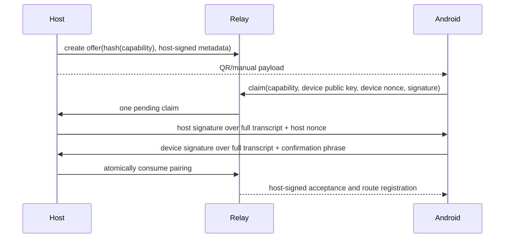

# Pairing, Identity, and Key Lifecycle

## Identity model

There is no central user account. Pairing creates a relationship between one Android device key and one computer key.

- **Computer identity:** P-256 signing key stored by the host in Windows Credential Locker or macOS Keychain via `keyring` 25.7.0. The broker verifies the selected backend is a supported native backend and fails closed; plaintext/file/null/third-party backends are rejected.
- **Android device identity:** non-exportable P-256 key generated in Android Keystore, with StrongBox requested when available but not required. High-risk signing requires user authentication via BiometricPrompt `CryptoObject`.
- **Relay service identity:** ordinary TLS certificate plus a relay signing key used only for relay-issued connection credentials. It is not a paired-device identity and cannot authorize host commands.

Public key thumbprints use RFC 7638. Display IDs are derived, never used as authenticators.

## Pairing offer

The local user selects “Pair Android device” in Desktop or CLI. Host creates:

- 256-bit random `pairingCapability`;
- `pairingId`, computer ID/display name, host public JWK/thumbprint;
- relay origin and optional direct endpoints/certificate pin;
- issued/expiry times (maximum two minutes);
- supported protocol range;
- host-signed offer JWS.

Relay stores only the salted hash of `pairingCapability`, single-use status, attempt count, offer metadata, and expiry. It limits claims by pairing ID, IP prefix, and device key. QR encodes a versioned HTTPS deep link; the same payload can be entered as a grouped manual code. The app never opens an arbitrary URL from QR content.

## Proof-of-possession transcript

The transcript hash binds protocol version, pairing ID/capability hash, both public keys/thumbprints, both nonces, relay origin, computer ID, device ID, issue/expiry times, and optional direct pin. Both screens show a six-word confirmation phrase derived from the transcript; the user confirms it locally and on Android. Acceptance is impossible after atomic consumption or expiry.

Pairing through a compromised trusted relay can be denied or observed. Proof of possession prevents substitution when the user compares the phrase; the host-signed QR additionally prevents a relay-created host identity. Pairing over direct fallback applies the same transcript without relay storage.

## Connection credentials

For each connection, relay sends a 256-bit nonce. Device/host signs `nonce || connectionId || audience || keyThumbprint || issuedAt`. After revocation and replay checks, relay issues a signed credential:

- audience restricted to the relay instance/service;
- subject is computer or device;
- paired counterpart/computer route;
- connection scope;
- issue time and five-minute expiry;
- unique JTI.

Credentials are kept in memory only and renewed with a fresh challenge. Long-lived bearer refresh tokens are not created.

## Step-up

App unlock requires BiometricPrompt or device credential according to local policy. High-risk actions require a fresh biometric-authenticated signature whose Keystore key authorization window is zero seconds. Medium-risk actions require the app to have been unlocked in the previous five minutes; otherwise step-up occurs. Low-risk read and prompt actions require an unlocked foreground app.

Biometric result alone is not transmitted. The proof is a signature by the authentication-bound key over the exact command digest.

## Rotation and revocation

- Device key rotation creates a new device ID and requires fresh pairing; silent migration is forbidden.
- Host key rotation displays a destructive warning, invalidates all device pairings, closes channels, and requires re-pairing.
- Relay TLS/service signing key rotation follows overlap and pinned-issuer operational procedures; it does not rotate paired keys.
- Revoking one device writes revocation state before acknowledging, closes all its channels, rejects credential renewal, and invalidates queued commands from it.
- “Revoke all” increments the computer trust epoch, invalidating every device and pairing offer.
- Lost-device recovery is local revocation from Desktop/CLI. There are no recovery codes or exported private-key backups.

## Storage rules

Host public metadata may live in `remote-control.db`; private keys never do. Android public pairing metadata is in DataStore; private key material never leaves Keystore. Relay stores public keys and revocation metadata, never private paired keys. Debug export includes thumbprints and timestamps but not capabilities, bearer credentials, nonces, transcripts, or content.

## Failure behavior

Unsupported secure store, invalid clock beyond a five-minute diagnostic tolerance, missing biometrics/device credential when policy requires them, changed host pin, duplicate pairing claim, or unavailable revocation persistence all fail closed. The UI explains recovery without offering an insecure bypass.
