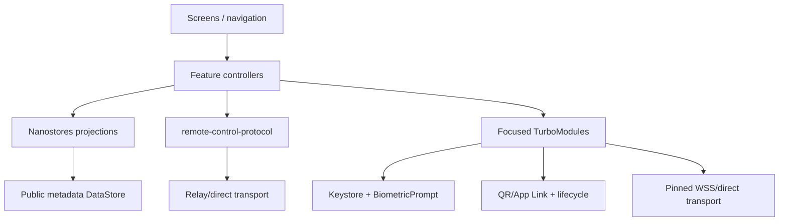

# Android Architecture

## Baseline

Use bare React Native 0.86.0 with TypeScript, React 19.2.8, the supported New Architecture, minimum Android API 24, JDK 17, and Node 22.11+ in CI. The checked environment lacks JDK/Android SDK and therefore cannot validate the app until Gate 1 provisioning. The upstream React Native template at implementation time is authoritative for Android Gradle Plugin, Gradle, Kotlin, NDK, and build settings; versions are not independently guessed.

Official references: [RN 0.86 release](https://reactnative.dev/blog/2026/06/11/react-native-0.86), [Turbo Native Modules](https://reactnative.dev/docs/turbo-native-modules-introduction), [Android environment setup](https://reactnative.dev/docs/set-up-your-environment), [Keystore](https://developer.android.com/privacy-and-security/keystore), and [BiometricPrompt](https://developer.android.com/identity/sign-in/biometric-auth).

## Layers

Feature stores are computer/session keyed and contain projections, not secrets. Reducers are pure and shared with protocol tests. The transport service owns reconnect/ack, while UI controllers own user intent and cancellation.

## Focused Kotlin modules

1. **`NativeHermesIdentity`** — generate/list/delete non-exportable P-256 aliases, public JWK/thumbprint, SHA-256/base64url digest, strict ES256 compact-JWS verification for host proofs, sign low/medium risk, sign high risk through BiometricPrompt `CryptoObject`, report secure hardware characteristics. This module implements the protocol package's narrow crypto adapter; do not assume React Native provides WebCrypto or add a Node-crypto polyfill.
2. **`NativeHermesSecureTransport`** — direct WSS with SPKI pin, strict TLS, no cleartext/user CA; relay networking may use RN/fetch/WebSocket only if equivalent lifecycle/pinning needs are met.
3. **`NativeHermesPairing`** — strict QR/manual/deep-link parsing, Google Code Scanner launch, verified App Link handoff. Manual entry is mandatory fallback for devices without Google Play services.
4. **`NativeHermesLifecycleSecurity`** — app lock state, foreground/background signals, secure-window toggle, screen-obscured touch policy, app-switcher snapshot protection.

Do not create a generic native bridge, shell bridge, file bridge, credential bridge, or arbitrary HTTP/TLS bypass.

## Persistence

- Android Keystore: device private keys only.
- Preferences DataStore 1.2.1: computer/device public metadata, UI choices, lock policy, last acknowledged cursor. Backup excluded.
- In-memory: relay credentials, pairing capability, decrypted transcript/tool output, pending commands, direct channel state.
- Optional local transcript cache is deferred; MVP fetches snapshot/replay and clears content on lock/background according to policy.

`androidx.security:security-crypto` and `EncryptedSharedPreferences` are not selected because Android marks those APIs deprecated; direct Keystore plus DataStore avoids a false encrypted-preferences abstraction.

## Navigation

Root stack:

1. App lock
2. Computers
3. Computer detail/session catalog
4. Session
5. Pairing
6. Device/security settings

Session tabs/regions cover conversation, activity/requests, and bounded terminal/files when capabilities permit. Every action header identifies computer and session. High-risk confirmation repeats both and the normalized action.

## Pairing and links

Use Google Code Scanner `com.google.android.gms:play-services-code-scanner:16.1.0` to avoid camera permission and bundled scanner size. Check Play services availability first; otherwise offer manual code and verified HTTPS App Link. Only the pairing activity is exported. Link parser accepts one scheme/version/origin, length limits every field, rejects duplicate parameters, and never fetches an untrusted relay URL without user-visible origin validation.

## Lifecycle/security

- Lock on cold start; optionally after five minutes background; always require step-up for high risk.
- `FLAG_SECURE` on pairing, key/device, approval, terminal-input, and attachment-preview screens.
- release Network Security Config sets `cleartextTrafficPermitted="false"` and trusts system CAs only for relay.
- direct pins are stored as public metadata bound to the paired host signature.
- `allowBackup=false` plus explicit extraction rules; no screenshots in recent-apps for sensitive screens.
- no notification permission, FCM SDK, background service, or wake lock in MVP.

## Accessibility and resilience

All streaming regions provide controllable announcements rather than token-by-token screen-reader spam. Tool/risk states include text and icons, not color alone. Interrupted/reconnecting state preserves typed prompt locally in memory. Rotation, process death, and network loss restore public navigation metadata, then obtain a fresh signed snapshot before enabling actions.
